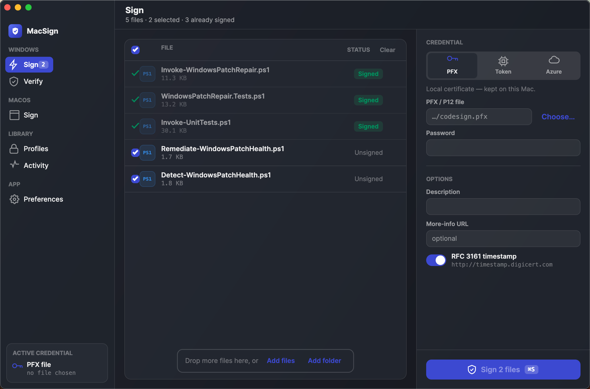
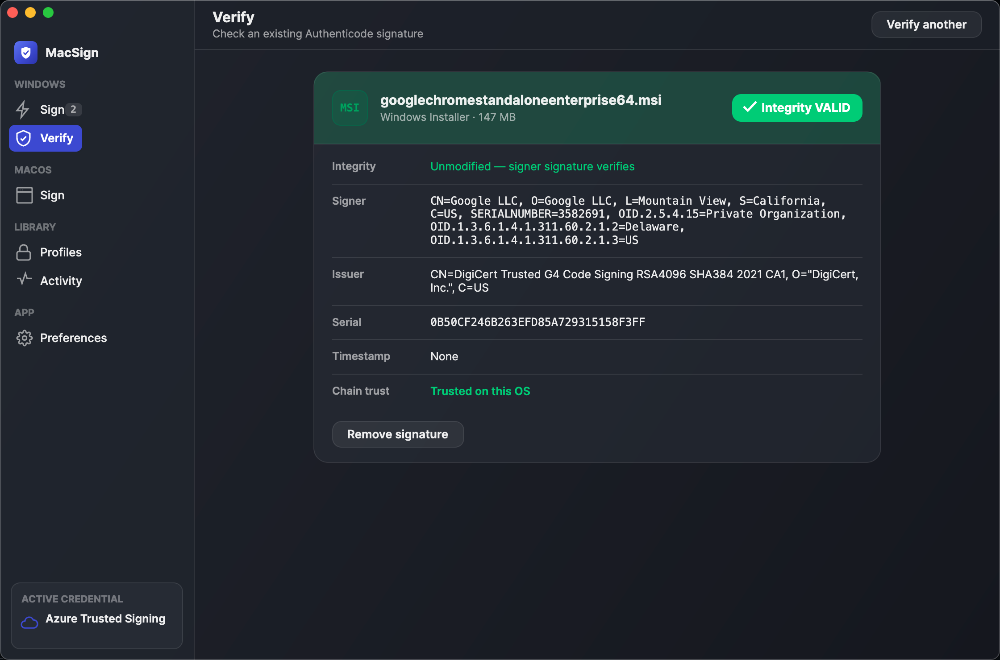
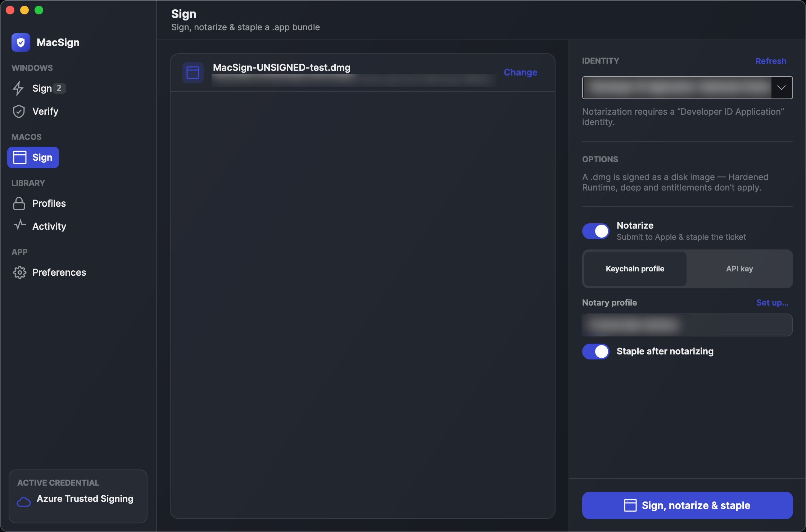
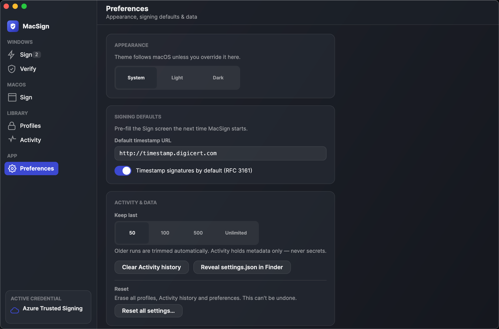

# MacSign

[](https://github.com/thefinder808/macsign/actions/workflows/ci.yml)
[](LICENSE)
[](https://github.com/thefinder808/macsign/releases)

Native macOS Authenticode signing for Windows artifacts — **no Windows machine, no `osslsigncode`, no `jsign`, no OpenSSL/JVM.** A fully managed .NET 10 engine.

<p align="center">
  
</p>

> **Status: all backends shipped.** Signs **PE files** (`.exe`/`.dll`/`.sys`, incl. managed assemblies), **PowerShell scripts** (`.ps1`), and **MSI installers** (`.msi`), using a **local PFX certificate**, a **PKCS#11 token / HSM**, or **Azure Trusted Signing** (a.k.a. Azure Artifact Signing) — for the token and cloud paths the key never leaves the device/cloud — with optional **RFC3161 timestamping**, and **verifies** signatures (integrity + chain report). The Azure path is proven offline by a contract test (delegated path == the signtool-proven in-proc path) and has been signed + verified end-to-end against a live Trusted Signing account; re-verify it anytime with `scripts/verify-azure.sh` (uses your `az login`, no stored credentials).

## Download

Grab the latest signed + notarized **DMG** for your Mac from the **[Releases](https://github.com/thefinder808/macsign/releases/latest)** page — `MacSign-<ver>-osx-arm64.dmg` for Apple Silicon, `-osx-x64.dmg` for Intel — open it, and drag **MacSign** to Applications. It's Developer ID–signed and Apple-notarized, so it opens with no Gatekeeper warning. (Requires macOS 11 Big Sur or later; the app is self-contained, so no .NET runtime is needed to run it.) After that MacSign keeps itself current: it checks for new releases on launch (toggle in Preferences) and via **Help → "Check for Updates…"**, and installs them in one click. Or build from source below.

## Why

The cross-platform tools for signing Windows binaries from a Mac are fiddly CLIs. MacSign reimplements Authenticode natively in .NET so signing is a single dependency-clean, notarizable app — and so the format logic is unit-testable and fully under our control.

## Layout

| Project | What |
|---|---|
| `src/MacSign.Signing` | The engine. No third-party deps; one Microsoft platform package (`System.Security.Cryptography.Pkcs`) for the CMS APIs. |
| `src/MacSign.Signing.Pkcs11` | Optional PKCS#11/HSM backend, quarantined so `Pkcs11Interop` stays out of the core. Loaded only by consumers that sign with a token. |
| `src/MacSign.Signing.Azure` | Optional Azure Trusted Signing backend, quarantined so `Azure.Identity` stays out of the core. A delegating RSA POSTs each digest to the cloud sign endpoint. |
| `src/MacSign.Signing.Msi` | Optional MSI backend, quarantined so the `OpenMcdf` (CFBF) dependency stays out of the core. |
| `src/MacSign.Cli` | A thin console harness (`macsign`) — scriptable signing/verifying. |
| `src/MacSign.App` | The native macOS GUI (.NET 10 + Avalonia) — consumes the engine in-process. Sign / Verify / Sign (Mac) / Profiles / Activity / Preferences, light + dark. |
| `src/MacSign.Fixture` | A trivial class library whose compiled DLL is the unsigned PE the tests/CI sign. |
| `tests/MacSign.Signing.Tests` | xUnit: PE digest, CMS framing, sign→verify round-trip, secret hygiene. |
| `tests/MacSign.App.Tests` | xUnit for the **macOS signing** (`codesign`/`notarytool`) wrapper: exact argv per option, identity allow-listing, `.dmg`-direct notarize, process injection/cancellation. |

## Build & test

Requires the **.NET 10 SDK**.

```bash
dotnet build -c Release
dotnet test
```

## Sign something

```bash
# Make a throwaway self-signed code-signing cert (test/dev only):
PFX_PW=secret dotnet run --project src/MacSign.Cli -- \
  gen-test-cert --pfx test.pfx --cer test.cer --password-env PFX_PW

# Sign a PE in place (optionally RFC3161-timestamped; --timestamp-url accepts a
# comma-separated list of TSAs tried in order, so one outage won't fail the sign):
PFX_PW=secret dotnet run --project src/MacSign.Cli -- \
  sign --pfx test.pfx --password-env PFX_PW --description "My App" \
  --timestamp-url http://timestamp.digicert.com some.dll

# Sign with a PKCS#11 token / HSM instead (key never leaves the device):
PIN=1234 dotnet run --project src/MacSign.Cli -- \
  sign --pkcs11-module /path/to/pkcs11.so --password-env PIN some.dll

# Sign with Azure Trusted Signing (key never leaves Azure). With no token flag the
# token is acquired via Azure.Identity (az login, env service principal, or managed
# identity); or pass one explicitly with --trusted-signing-token[-env].
# --trusted-signing-tenant pins the directory (a GUID or a domain) — set it when the
# account holding the signing role lives in a different tenant than your everyday
# sign-in, since a token minted in the wrong tenant is rejected whatever roles it has:
dotnet run --project src/MacSign.Cli -- \
  sign --trusted-signing-endpoint eus.codesigning.azure.net \
       --trusted-signing-account my-account \
       --trusted-signing-profile my-profile \
       --trusted-signing-tenant contoso.onmicrosoft.com some.dll

# Verify a signature (reports signer, timestamp, integrity, and chain trust):
dotnet run --project src/MacSign.Cli -- verify some.dll

# Remove an existing signature, in place (PE / PowerShell / MSI):
dotnet run --project src/MacSign.Cli -- remove some.dll
```

### Choosing which Azure account signs

Trusted Signing authorises the **identity** presented, not the machine, so signing fails if the token comes from the wrong account or the wrong directory — and by default that identity is simply whichever account `az login` last selected. Three ways to control it, in increasing order of directness:

- **Pin the directory** with `--trusted-signing-tenant <guid-or-domain>`. Use this when the account holding the signing role lives in a different tenant than your everyday sign-in; a token minted in the wrong tenant is rejected no matter which roles it has.
- **Change the CLI's account** with `az login --tenant <id>`, the idiomatic answer for scripts and CI. For an unattended pipeline, prefer an environment service principal (`AZURE_CLIENT_ID`/`AZURE_TENANT_ID`/`AZURE_CLIENT_SECRET`) or a pre-fetched `--trusted-signing-token-env`.
- **Sign in through a browser** from the app's Sign screen and pick the account yourself. Useful when the machine's default sign-in keeps reverting — with macOS Platform SSO, for instance, `az login` tends to land back on the device-registered account. The chosen account is remembered across launches in the OS keychain, and **Switch account** changes it. Signing itself never opens a browser, so it can't interrupt a batch.

MacSign names the account throughout, so you never have to guess which one is in play: a **successful** sign reports it (in the app's banner, in Activity, and on the CLI — `Done. Signed as user@contoso.com (tenant …)`), a **rejected** token's error names the account and tenant it was issued to, and the Sign screen's **"Who would sign?"** answers the question up front for the default sign-in. That last one costs a token, not a signature.

`verify` reports **signature integrity** (file unmodified + signer signature valid) separately from **chain trust** — on macOS the Microsoft roots aren't in the system store, so chain trust usually can't be established, but integrity can be asserted authoritatively. It lists **every signer** on a co-signed binary and flags a **nested signature**, and only surfaces an RFC3161 **timestamp it has cryptographically validated** (a forged or grafted token is not shown as the signing time).

## Native macOS app (GUI)

A native macOS GUI (`src/MacSign.App`, .NET 10 + Avalonia) consumes the same engine **in-process** — no shelling out. Six screens: **Sign** (drag-drop files + a credential/options inspector, ⌘S to sign), **Verify** (a Windows artifact's integrity vs. chain-trust report, *or* a Mac `.app`/`.dmg`'s `codesign` signature — signer, Team ID, Hardened Runtime, notarization — and **Remove signature** for a signed Authenticode file, with a two-step confirm), **Sign (Mac)** (sign, notarize & staple a `.app` bundle or `.dmg` with your Developer ID), **Profiles** (reusable presets — no secrets stored), **Activity** (run history), and **Preferences** (⌘, — theme override, signing defaults, data housekeeping, and an **Updates** section: "Check for updates automatically" toggle + "Check Now"). The sidebar groups these by domain (**Windows** · **macOS** · **Library** · **App**), and a native menu bar (File · Edit · View · Window · Help, plus an About box) rounds out the shell. Full light + dark, following the macOS appearance. MacSign checks for a newer release on launch — throttled to once per day, on by default — and **Help → "Check for Updates…"** triggers it on demand; when an update is found you can **download, verify, and install in one click**: the notarized, Developer ID–signed app inside the downloaded DMG (Team ID `Q6LRJQSA42`) is the trust anchor, so no separate appcast or signing key is needed. It degrades gracefully if the install directory isn't writable or signature verification fails.

<table>
  <tr>
    <td width="33%" valign="top"><a href="docs/screenshots/verify.png"></a><br><sub><b>Verify</b> — integrity vs. chain trust, every signer, a validated timestamp</sub></td>
    <td width="33%" valign="top"><a href="docs/screenshots/mac-signing.png"></a><br><sub><b>Sign (Mac)</b> — sign · notarize · staple a <code>.app</code>/<code>.dmg</code></sub></td>
    <td width="33%" valign="top"><a href="docs/screenshots/preferences.png"></a><br><sub><b>Preferences</b> — theme, signing defaults, data housekeeping</sub></td>
  </tr>
</table>

> **Sign (Mac)** is the inverse of the engine's day job: rather than signing Windows artifacts, it signs **your Mac apps**. It's a thin, injection-safe wrapper over Apple's own `codesign` / `notarytool` / `stapler` (not a reimplementation) — choose a `.app` or `.dmg`, pick a Developer ID identity, and watch sign → verify → notarize → staple stream in a live log. You can also **create the keychain notary profile in-app** — Notarize → Keychain profile → **Set up…** runs `notarytool store-credentials` from an App Store Connect API key, so you never need Terminal for it (API-key only; the key stays in its `.p8`). Before submitting to the notary it runs a **pre-flight** (mounting a `.dmg` to inspect its contents) and stops — with a "Notarize anyway" override — if anything inside isn't signed/hardened, so you don't burn a multi-minute round-trip on a doomed upload.
>
> If the pre-flight finds unsigned `.app` bundles inside your `.dmg`, a **"Sign contents & continue"** button appears alongside "Notarize anyway". Clicking it signs the problematic apps inside the image — with Hardened Runtime and deep signing, using the Developer ID identity already chosen, and applying your Entitlements `.plist` if you've set one (recommended for JIT-enabled apps such as .NET apps that need `allow-jit`) — re-seals the DMG in place, and then proceeds automatically to sign, notarize, and staple. Only the apps that failed the pre-flight checks are re-signed; already-valid signatures are left untouched.

```bash
dotnet run --project src/MacSign.App          # run from source

# Build a signed + notarized DMG (Developer ID + a notarytool keychain profile):
SIGN_IDENTITY="Developer ID Application: NAME (TEAMID)" \
NOTARY_PROFILE=your-notary-profile ./build-macos.sh
# (omit the env vars for an unsigned local build)
```

**Releases are tag-driven:** push a `v*` tag and CI builds, signs, notarizes, and publishes the `arm64` + `x64` DMGs to a GitHub Release (`.github/workflows/release.yml`). Setup + required secrets: [`docs/RELEASE-SIGNING.md`](docs/RELEASE-SIGNING.md).

Prefer supplying the password (or PIN, or Azure token) via an environment variable — `--password-env` / `--trusted-signing-token-env`. The plaintext `--password` / `--trusted-signing-token` flags still work, but MacSign warns about them: an argv secret lands in your shell history and the process list (`ps`). Secrets are never persisted, logged, or placed on a child-process command line.

## Verifying the signature

The authoritative check is **Windows `signtool`**, run in CI (`.github/workflows/ci.yml`): the macOS job signs a fixture PE and uploads it; a `windows-latest` job runs `signtool verify /pa` against it. That gate proves the cross-platform claim and must stay green.

Locally on macOS you can sanity-check with `osslsigncode` (chain trust will fail for a self-signed cert — that's expected; supply the cert as a trusted root to get a full pass):

```bash
osslsigncode verify some.dll                       # parses + checks digest/signature
openssl x509 -inform DER -in test.cer -out test.pem
osslsigncode verify -CAfile test.pem -ignore-timestamp some.dll   # full pass
```

## Support

If MacSign saves you a Windows VM, you can support development here: https://www.buymeacoffee.com/thefinder808

## License & project

Licensed under the [Apache-2.0 License](LICENSE). Release notes live in the [CHANGELOG](CHANGELOG.md). Contributions are welcome — see [CONTRIBUTING.md](CONTRIBUTING.md) and the [Code of Conduct](CODE_OF_CONDUCT.md). To report a security issue, follow the [security policy](.github/SECURITY.md).
